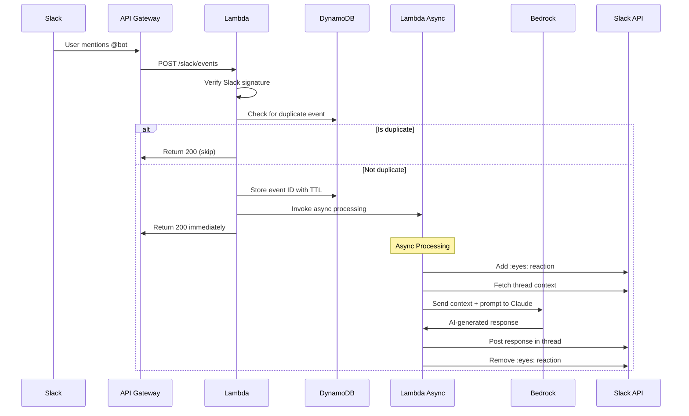

# Slack AI Assistant

A serverless Slack bot that leverages Amazon Bedrock's Claude AI to provide intelligent responses in Slack conversations. Built with AWS Lambda, this bot processes Slack events asynchronously and maintains conversation context across threads.

## How It Works



## Architecture Overview

The bot uses a serverless architecture with the following key components:

- **API Gateway**: Receives webhook events from Slack
- **Lambda Function**: Processes events with two execution modes:
  - Synchronous: Validates requests and handles deduplication
  - Asynchronous: Processes AI responses without blocking
- **DynamoDB**: Stores processed event IDs to prevent duplicate processing
- **Amazon Bedrock**: Provides AI responses using Claude Sonnet model
- **Slack API**: Fetches thread context and posts responses

## Prerequisites

- AWS Account with appropriate permissions
- Slack Workspace with admin access
- Java 21
- AWS SAM CLI
- Gradle 8.x

## Quick Start

### 1. Clone the Repository

```bash
git clone <repository-url>
cd tools-slack-ai-assistant
```

### 2. Configure Slack App

1. Go to [api.slack.com/apps](https://api.slack.com/apps)
2. Create a new app using the provided `slack-manifest.yaml`
3. Install the app to your workspace
4. Copy the Bot User OAuth Token and Signing Secret

### 3. Build and Deploy

```bash
# Build the application
make build

# Deploy with guided prompts
make deploy

# Or deploy without confirmation
make deploy-no-confirm
```

During deployment, you'll need to provide:
- `SlackSigningSecret`: Your Slack app's signing secret
- `SlackBotToken`: Your Slack bot's OAuth token

### 4. Configure Slack Event Subscriptions

After deployment, SAM will output the API Gateway URL:

```
SlackWebhookUrl: https://<api-id>.execute-api.<region>.amazonaws.com/Prod/slack/events
```

Add this URL to your Slack app's Event Subscriptions settings.

## Development

### Project Structure

```
.
├── src/
│   ├── main/java/org/bvnk/slackbot/
│   │   ├── handler/           # Lambda handlers
│   │   │   ├── SlackEventHandler.java      # Main entry point
│   │   │   └── AsyncProcessorHandler.java  # Async AI processing
│   │   ├── service/           # Business logic
│   │   │   ├── BedrockService.java        # AI integration
│   │   │   ├── SlackService.java          # Slack API client
│   │   │   ├── DynamoService.java         # Database operations
│   │   │   └── LambdaInvokeService.java   # Async invocation
│   │   ├── model/             # Data models
│   │   └── util/              # Utilities
│   └── resources/
│       └── application.properties
├── events/                    # Sample test events
├── template.yaml             # SAM template
├── build.gradle              # Build configuration
└── Makefile                  # Build automation
```

### Local Testing

Test the function locally using SAM:

```bash
# Test with a sample event
sam local invoke SlackBotFunction --event events/test-event.json

# Start local API
sam local start-api

# Test URL verification
curl -X POST http://localhost:3000/slack/events \
  -H "Content-Type: application/json" \
  -d @events/url-verification.json
```

### Running Tests

```bash
make test
# or
./gradlew test
```

### Viewing Logs

```bash
make logs
# or
sam logs -n SlackBotFunction --stack-name slack-ai-assistant --tail
```

## Configuration

### Environment Variables

The Lambda function uses the following environment variables:

| Variable | Description | Default |
|----------|-------------|---------|
| `SLACK_SIGNING_SECRET` | Slack app signing secret | Required |
| `SLACK_BOT_TOKEN` | Slack bot OAuth token | Required |
| `DYNAMO_TABLE` | DynamoDB table name | Set by SAM |
| `BEDROCK_MODEL_ID` | Bedrock model identifier | `anthropic.claude-sonnet-4-20250514-v1:0` |
| `LOG_LEVEL` | Logging level | `INFO` |

### Bedrock Model

The bot uses Claude Sonnet by default. To use a different model, update the `BEDROCK_MODEL_ID` environment variable in `template.yaml`.

## Features

- **Thread Context Awareness**: Maintains conversation context within Slack threads
- **Async Processing**: Responds immediately to Slack, processes AI in background
- **Deduplication**: Prevents processing the same event multiple times
- **Visual Feedback**: Shows :eyes: reaction while processing
- **Signature Verification**: Validates all requests from Slack
- **Error Handling**: Graceful error handling with user-friendly messages

## Security

- All Slack requests are verified using HMAC signature validation
- Secrets are stored in AWS Systems Manager Parameter Store
- Lambda function has minimal required permissions
- DynamoDB encryption at rest enabled

## Monitoring

The application includes:
- CloudWatch Logs for all Lambda invocations
- CloudWatch Metrics for function performance
- X-Ray tracing support (can be enabled in template.yaml)

## Troubleshooting

### Common Issues

1. **"Invalid signature" errors**
   - Verify your Slack signing secret is correct
   - Check that the request timestamp is within 5 minutes

2. **Bot not responding**
   - Check CloudWatch logs: `make logs`
   - Verify bot has been added to the channel
   - Ensure Event Subscriptions are enabled in Slack

3. **Timeout errors**
   - Increase Lambda timeout in template.yaml
   - Check Bedrock quota limits in your AWS account

4. **Duplicate messages**
   - This is prevented by DynamoDB deduplication
   - Check if DynamoDB table has proper TTL configuration

## Contributing

1. Fork the repository
2. Create a feature branch
3. Make your changes
4. Run tests: `make test`
5. Submit a pull request

## Disclaimer

**This code is provided as-is and mostly written by AI and has not been thoroughly tested at any significant scale.** Use at your own risk in production environments. The implementation should be reviewed and tested according to your organization's standards before deployment.

## License

This project is licensed under the MIT License - see the [LICENSE](LICENSE) file for details.

## Support

For issues and questions:
- Check the [troubleshooting guide](#troubleshooting)
- Review CloudWatch logs
- Open an issue in the repository